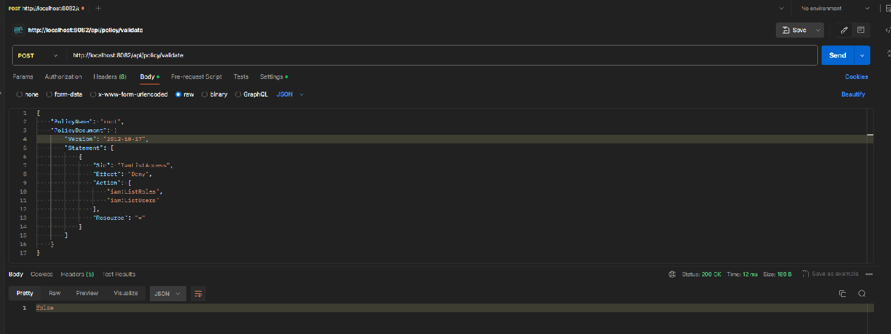
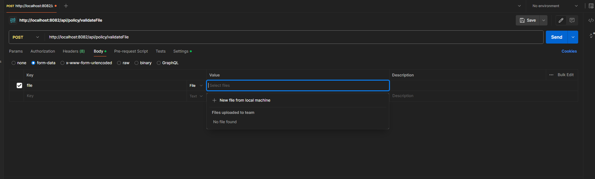
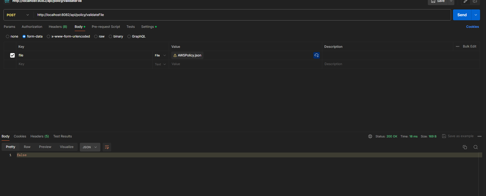

# AWS Policy Project

This project is designed to run in a Docker container. Below are the steps to build and run the application using Docker Compose.

## Prerequisites
Ensure you have Docker and Docker Compose installed on your system. You can download them from the [Docker website](https://www.docker.com/get-started) to run application.
Ensure you have Maven installed on your system. You can download it from the [Maven website](https://maven.apache.org/download.cgi) for tests.
Ensure you have Postman installed on your system. You can download it from the [Postman website](https://www.postman.com/downloads/) for testing the API.
## Running the Application

1. Navigate to the project directory where the `docker-compose.yml` file is located.

2. Build the Docker image and spin up the container by running:
    ```bash
    docker-compose up 
    ```
It may take a few minutes to download the required images and build the application.

3. Once the container is running, the application will be accessible via:
    ```bash
    http://localhost:8082/api/policy/validate <-- POST request with JSON body in Postman
   
    http://localhost:8082/api/policy/validateFile <-- POST request with file upload in Postman (make your own file with .json extension and upload it in Postman)
    ```
4. To stop and remove the containers, use:
    ```bash
    docker-compose down
    ```

Please note that the application’s services and dependencies are defined in the `docker-compose.yml` file.

## Running the Tests Locally
1. Open a terminal and navigate to the project directory where the `pom.xml` file is located.
2. Run the following command:
```bash 
mvn test
```
This will run the tests and display the results in the terminal.

## Example screenshots
1. Postman response for JSON body

2. Postman upload file.

3.Postman response for JSON body as file.



